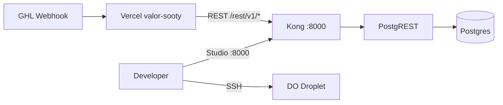

# Self-Hosted Supabase on DigitalOcean Droplet

Run the Valor Tax automation database (Postgres + PostgREST API) on your own VPS using the **official Supabase Docker Compose stack**, then apply the Valor app schema from this repo.

| Item | Value (Valor droplet) |
|------|------------------------|
| Droplet IP | `138.197.80.72` |
| SSH key | `/Volumes/JASONT9/Dev/keys/karim_sqp` |
| Default API port | `8000` (Kong gateway) |
| Project directory on server | `~/supabase-project` (Supabase stack) + `~/valor-supabase` (Valor scripts) |

---

## Directory layout on the droplet

There are **two separate folders** — do not confuse them:

| Path | What it is |
|------|------------|
| `~/supabase-project/` | Official Supabase Docker Compose stack (`docker-compose.yml`, `.env`, `run.sh`) |
| `~/valor-supabase/scripts/` | Valor repo scripts copied from this project (`bootstrap.sh`, `apply-valor-schema.sh`, etc.) |

`run.sh secrets` only works inside **`~/supabase-project`**, not `~/valor-supabase/scripts`.

If you are unsure where Supabase was installed:

```bash
find ~ -name "run.sh" 2>/dev/null
```


## What you get

- **Supabase stack** (Postgres, PostgREST, Auth, Realtime, Storage, Studio) via Docker Compose
- **Valor tables**: `task_logs`, `pending_tasks`, `officers`, `round_robin`
- **13 officers** seeded on first schema apply
- **REST API** compatible with the existing Vercel app (`vercel-webhook/lib/supabase.js`)

The Vercel app only needs:

- `SUPABASE_URL` → `http://<droplet-ip>:8000` (or `https://db.yourdomain.com` with a reverse proxy)
- `SUPABASE_SERVICE_ROLE_KEY` → `SUPABASE_SECRET_KEY` from the droplet `.env`

---

## Architecture



---

## Prerequisites

### Droplet sizing (official Supabase minimums)

| Resource | Minimum | Recommended |
|----------|---------|-------------|
| RAM | 4 GB | 8 GB+ |
| CPU | 2 cores | 4 cores+ |
| Disk | 40 GB SSD | 80 GB+ SSD |

### Local machine

- SSH access to the droplet
- This repo cloned or copied to the server

### On the droplet

- Ubuntu/Debian (DigitalOcean default is fine)
- Ports **8000** open in the cloud firewall (and **443** later if you add HTTPS)

---

## 1. SSH into the droplet

From your Mac:

```bash
ssh -i /Volumes/JASONT9/Dev/keys/karim_sqp root@138.197.80.72
```

If your droplet uses a non-root user, replace `root` with that username.

---

## 2. Install Docker (if not already installed)

The official bootstrap script can install Docker on supported Linux distros. To install manually:

```bash
curl -fsSL https://get.docker.com | sh
sudo usermod -aG docker "$USER"
# log out and back in so docker group applies
docker --version
docker compose version
```

---

## 3. Copy Valor infra files to the droplet

**Option A — clone the repo on the droplet**

```bash
git clone https://github.com/<your-org>/Valor-Tax-automation.git
cd Valor-Tax-automation/infra/supabase-droplet/scripts
chmod +x *.sh
```

**Option B — copy only the infra folder from your laptop**

```bash
scp -i /Volumes/JASONT9/Dev/keys/karim_sqp -r \
  /Volumes/JASONT9/Dev/Valor-Tax-automation/infra/supabase-droplet \
  root@138.197.80.72:~/valor-supabase
```

Then on the droplet:

```bash
cd ~/valor-supabase/scripts
chmod +x *.sh
```

---

## 4. Bootstrap Supabase (Docker Compose)

On the droplet:

```bash
export DROPLET_IP=138.197.80.72
export SUPABASE_PROJECT_DIR=~/supabase-project
bash bootstrap.sh
```

What `bootstrap.sh` does:

1. Runs the [official Supabase setup script](https://supabase.com/docs/guides/self-hosting/docker) (`https://supabase.link/setup.sh`)
2. Sets `SUPABASE_PUBLIC_URL`, `API_EXTERNAL_URL`, and `SITE_URL` to your droplet IP
3. Pulls images and starts the stack (`sh run.sh start`)

First start can take **5–15 minutes**. Check health:

```bash
cd ~/supabase-project
docker compose ps
```

All services should show `Up (healthy)`.

View generated secrets:

```bash
cd ~/supabase-project
sh run.sh secrets
```

Studio (dashboard) URL: **http://138.197.80.72:8000**  
Log in with `DASHBOARD_USERNAME` / `DASHBOARD_PASSWORD` from `.env` (see below).

### One-command deploy from Mac

If your SSH key has a passphrase, run from your laptop (interactive terminal):

```bash
cd /Volumes/JASONT9/Dev/Valor-Tax-automation
./infra/supabase-droplet/scripts/deploy-from-mac.sh
```

This copies infra, bootstraps Supabase, applies schema, and prints credentials.

### apt lock error on fresh droplets

If bootstrap fails with:

```text
E: Could not get lock /var/lib/apt/lists/lock. It is held by process ... (apt-get)
```

Ubuntu is running `unattended-upgrades` in the background. Wait and retry:

```bash
while fuser /var/lib/apt/lists/lock >/dev/null 2>&1; do echo "waiting for apt..."; sleep 5; done
export DROPLET_IP=138.197.80.72
cd ~/valor-supabase/scripts
bash bootstrap.sh
```

`bootstrap.sh` now waits for the apt lock automatically. If still stuck after 5+ minutes:

```bash
sudo rm -f /var/lib/apt/lists/lock /var/lib/dpkg/lock-frontend /var/lib/dpkg/lock
sudo dpkg --configure -a
```

---

## Accessing Supabase Studio (dashboard password)

Studio is the web UI at **http://138.197.80.72:8000**. It uses HTTP basic auth (browser username/password prompt).

### How to find the password

SSH into the droplet, then **change to the Supabase project directory**:

```bash
ssh -i /Volumes/JASONT9/Dev/keys/karim_sqp root@138.197.80.72
cd ~/supabase-project
```

**Option 1 — print all credentials (recommended)**

```bash
sh run.sh secrets
```

**Option 2 — read from `.env` directly**

```bash
grep DASHBOARD_USERNAME .env
grep DASHBOARD_PASSWORD .env
```

**Option 3 — from Valor scripts folder**

```bash
cd ~/valor-supabase/scripts
export SUPABASE_PROJECT_DIR=~/supabase-project
bash show-credentials.sh
```

### Studio login

| Field | Value |
|-------|--------|
| URL | `http://138.197.80.72:8000` |
| Username | `supabase` (or value of `DASHBOARD_USERNAME` in `.env`) |
| Password | value of `DASHBOARD_PASSWORD` in `~/supabase-project/.env` |

### Common mistake

Running `sh run.sh secrets` from `~/valor-supabase/scripts` fails:

```text
sh: 0: cannot open run.sh: No such file
```

Fix: `cd ~/supabase-project` first — `run.sh` lives with the official Supabase stack, not the Valor scripts.

---

## 5. Open firewall port 8000

On the droplet (if using `ufw`):

```bash
sudo ufw allow OpenSSH
sudo ufw allow 8000/tcp
sudo ufw enable
sudo ufw status
```

In **DigitalOcean → Networking → Firewalls**, also allow inbound **TCP 8000** from:

- Vercel egress IPs (if restricting), or
- `0.0.0.0/0` temporarily for testing (tighten for production)

---

## 6. Apply Valor database schema

On the droplet:

```bash
export SUPABASE_PROJECT_DIR=~/supabase-project
bash apply-valor-schema.sh
```

This runs `infra/supabase-droplet/sql/valor_schema.sql` against Postgres and creates:

| Table | Purpose |
|-------|---------|
| `task_logs` | Webhook/cron execution history |
| `pending_tasks` | Retry queue (missing appointment, case not found, etc.) |
| `officers` | Round-robin roster (dashboard-managed) |
| `round_robin` | Single row (`id=1`) with `current_index` |

Schema sources in this repo (for reference):

- `vercel-webhook/supabase/task_logs.sql`
- `vercel-webhook/supabase/pending_tasks.sql`
- `vercel-webhook/supabase/add_case_not_found_columns.sql`
- `vercel-webhook/supabase/add_ai_columns_to_task_logs.sql`

Verify from your laptop:

```bash
# Replace SECRET_KEY with value from droplet .env (SUPABASE_SECRET_KEY)
curl -s "http://138.197.80.72:8000/rest/v1/officers?select=name,user_id&is_active=eq.true" \
  -H "apikey: SECRET_KEY" \
  -H "Authorization: Bearer SECRET_KEY"
```

You should see 13 officers as JSON.

On the droplet, print ready-to-copy env vars:

```bash
cd ~/valor-supabase/scripts
export SUPABASE_PROJECT_DIR=~/supabase-project
bash show-credentials.sh
```

`show-credentials.sh` prints `SUPABASE_URL` and `SUPABASE_SERVICE_ROLE_KEY` for Vercel. For the Studio browser password, use `sh run.sh secrets` in `~/supabase-project` (see [Accessing Supabase Studio](#accessing-supabase-studio-dashboard-password)).

---

## 7. Point the Vercel app at the droplet

Update environment variables for the **valor** Vercel project:

| Variable | Value |
|----------|--------|
| `SUPABASE_URL` | `http://138.197.80.72:8000` |
| `SUPABASE_SERVICE_ROLE_KEY` | `SUPABASE_SECRET_KEY` from `~/supabase-project/.env` |

```bash
cd vercel-webhook
npx vercel env rm SUPABASE_URL production
npx vercel env add SUPABASE_URL production
# paste: http://138.197.80.72:8000

npx vercel env rm SUPABASE_SERVICE_ROLE_KEY production
npx vercel env add SUPABASE_SERVICE_ROLE_KEY production
# paste secret key from droplet
```

Redeploy after changing env vars:

```bash
npx vercel --prod
```

**Local `.env`** (for development against the droplet):

```env
SUPABASE_URL=http://138.197.80.72:8000
SUPABASE_SERVICE_ROLE_KEY=<SUPABASE_SECRET_KEY from droplet>
```

---

## 8. Custom domains + HTTPS (`valortaxrelief.com`)

Use two subdomains:

| Subdomain | Purpose | Used by |
|-----------|---------|---------|
| `supabase.valortaxrelief.com` | REST API (`/rest/v1/`), Auth, Realtime | Vercel app (`SUPABASE_URL`) |
| `supadashboard.valortaxrelief.com` | Supabase Studio (web UI) | Developers in browser |

Both point to the same droplet. Caddy terminates TLS (Let's Encrypt) and routes traffic to Kong (API) or Studio (dashboard).

### Step 1 — Add DNS records

In your DNS provider for **valortaxrelief.com** (Cloudflare, Namecheap, DigitalOcean DNS, etc.), add **two A records**:

| Type | Name / Host | Value | TTL |
|------|-------------|-------|-----|
| **A** | `supabase` | `138.197.80.72` | 300 (or Auto) |
| **A** | `supadashboard` | `138.197.80.72` | 300 (or Auto) |

Full hostnames:

- `supabase.valortaxrelief.com` → `138.197.80.72`
- `supadashboard.valortaxrelief.com` → `138.197.80.72`

**Cloudflare tip:** set proxy status to **DNS only** (grey cloud) while first obtaining the Let's Encrypt certificate. You can enable the orange cloud proxy after HTTPS works.

**Do not** use CNAME unless you have a stable hostname — A records to the droplet IP are simplest.

Verify propagation (from your Mac):

```bash
dig +short supabase.valortaxrelief.com A
dig +short supadashboard.valortaxrelief.com A
# Both should return: 138.197.80.72
```

### Step 2 — Open ports 80 and 443

Caddy needs HTTP (80) for certificate challenges and HTTPS (443) for traffic.

**On the droplet:**

```bash
sudo ufw allow 80/tcp
sudo ufw allow 443/tcp
sudo ufw status
```

**DigitalOcean → Networking → Firewalls:** allow inbound **TCP 80** and **TCP 443** (in addition to SSH and optional 8000).

### Step 3 — Enable HTTPS on the droplet

Copy updated infra (if not already on server), then run:

```bash
# From Mac — copy latest scripts + Caddyfile
scp -i /Volumes/JASONT9/Dev/keys/karim_sqp -r \
  /Volumes/JASONT9/Dev/Valor-Tax-automation/infra/supabase-droplet \
  root@138.197.80.72:~/valor-supabase

# On droplet
ssh -i /Volumes/JASONT9/Dev/keys/karim_sqp root@138.197.80.72
cd ~/valor-supabase/scripts
chmod +x enable-https-domains.sh
export DROPLET_IP=138.197.80.72
bash enable-https-domains.sh
```

The script:

1. Verifies DNS points to the droplet
2. Installs `infra/supabase-droplet/volumes/proxy/caddy/Caddyfile`
3. Sets `SUPABASE_PUBLIC_URL` / `API_EXTERNAL_URL` to `https://supabase.valortaxrelief.com`
4. Enables the official `docker-compose.caddy.yml` override
5. Restarts the stack — Caddy auto-provisions TLS certificates

### Step 4 — Update Vercel + local `.env`

| Variable | New value |
|----------|-----------|
| `SUPABASE_URL` | `https://supabase.valortaxrelief.com` |
| `SUPABASE_SERVICE_ROLE_KEY` | unchanged (`SUPABASE_SECRET_KEY` from droplet `.env`) |

```bash
cd vercel-webhook
npx vercel env add SUPABASE_URL production
# paste: https://supabase.valortaxrelief.com
npx vercel --prod
```

**Local `.env`:**

```env
SUPABASE_URL=https://supabase.valortaxrelief.com
SUPABASE_SERVICE_ROLE_KEY=<SUPABASE_SECRET_KEY from droplet>
```

### After HTTPS is live

| Service | URL |
|---------|-----|
| API / Vercel | `https://supabase.valortaxrelief.com` |
| REST example | `https://supabase.valortaxrelief.com/rest/v1/officers` |
| Studio | `https://supadashboard.valortaxrelief.com` |
| Studio login | `DASHBOARD_USERNAME` / `DASHBOARD_PASSWORD` from `~/supabase-project/.env` |

Test API:

```bash
curl -s "https://supabase.valortaxrelief.com/rest/v1/officers?select=name&limit=1" \
  -H "apikey: <SECRET_KEY>" \
  -H "Authorization: Bearer <SECRET_KEY>"
```

Port **8000** is no longer needed publicly once Caddy is active (Kong is internal). You can remove the DO firewall rule for 8000 after confirming HTTPS works.

---

## Day-2 operations

### Start / stop / logs

```bash
cd ~/supabase-project
sh run.sh start    # start stack
sh run.sh stop     # stop stack
sh run.sh logs db  # follow Postgres logs
docker compose ps  # service health
```

### Re-apply schema (safe — idempotent)

```bash
bash apply-valor-schema.sh
```

### Backup Postgres

```bash
cd ~/supabase-project
docker compose exec -T db pg_dump -U postgres postgres > valor-backup-$(date +%Y%m%d).sql
```

### Restore

```bash
docker compose exec -T db psql -U postgres -d postgres < valor-backup-YYYYMMDD.sql
```

### Update Supabase images

Follow [Supabase self-hosting update guide](https://supabase.com/docs/guides/self-hosting/docker#updating):

```bash
cd ~/supabase-project
sh run.sh pull
sh run.sh recreate
```

Always backup before updating.

---

## Production hardening (recommended)

The default Docker setup is **not production-safe** until you:

1. **Use HTTPS** — put Caddy or Nginx in front of port 8000 ([Supabase HTTPS guide](https://supabase.com/docs/guides/self-hosting/self-hosted-proxy-https))
2. **Use a domain** — e.g. `https://supabase.valortax.com` instead of raw IP
3. **Restrict port 8000** — only allow Vercel + office IPs; block public Postgres (`5432`) from the internet
4. **Rotate secrets** — never use example passwords from `.env.example`; `bootstrap.sh` generates new ones via the official script
5. **Automate backups** — cron `pg_dump` to object storage daily

### Slim stack (smaller droplet)

If you do not need Storage, Realtime, or Edge Functions, remove those services from `docker-compose.yml` per [Supabase docs](https://supabase.com/docs/guides/self-hosting/docker#system-requirements) to save RAM.

---

## Troubleshooting

| Symptom | Fix |
|---------|-----|
| `sh: cannot open run.sh: No such file` | Wrong directory — run from `~/supabase-project`, not `~/valor-supabase/scripts` |
| Forgot Studio password | `cd ~/supabase-project && sh run.sh secrets` or `grep DASHBOARD_PASSWORD .env` |
| `Permission denied (publickey)` on SSH | Confirm `karim_sqp.pub` is on the droplet; key perms `chmod 600` |
| apt lock during bootstrap | Wait for `unattended-upgrades`; see [apt lock error](#apt-lock-error-on-fresh-droplets) |
| `Connection refused` on `:8000` | `docker compose ps`; open DO firewall + `ufw` |
| Vercel `task_logs insert failed` | Re-run `apply-valor-schema.sh`; check REST with `curl` |
| `401` from REST API | Wrong `SUPABASE_SERVICE_ROLE_KEY`; use `SUPABASE_SECRET_KEY` from droplet `.env` |
| Kong won't start | CRLF line endings in compose files — re-clone Supabase docker config |
| Out of memory | Upgrade droplet or disable unused compose services |

Inspect a failing container:

```bash
cd ~/supabase-project
sh tests/test-container-logs.sh
sh run.sh logs kong
```

---

## File reference (this repo)

```
infra/supabase-droplet/
├── sql/
│   └── valor_schema.sql       # Valor tables + grants + officer seed
└── scripts/
    ├── bootstrap.sh           # Install & start official Supabase stack
    ├── apply-valor-schema.sh  # Load schema into Postgres
    ├── deploy-from-mac.sh     # One-shot deploy from laptop (SSH + scp)
    ├── enable-https-domains.sh  # Caddy + TLS for custom subdomains
    └── show-credentials.sh    # Print Vercel env values
├── volumes/
│   └── proxy/caddy/
│       └── Caddyfile          # supabase.* + supadashboard.* routing
```

Official Supabase files live **on the droplet** in `~/supabase-project/` (not committed to this repo).

---

## Migrating from Supabase Cloud

If you already have data in hosted Supabase (`znqzlmlkcbpfjdngspdu`):

1. Export tables from cloud Studio or `pg_dump` via Supabase connection string
2. Import into self-hosted Postgres after schema apply
3. Switch Vercel env vars
4. Smoke test: book a test appointment → confirm `task_logs` row on droplet

---

## Quick checklist for new developers

- [ ] SSH: `ssh -i /Volumes/JASONT9/Dev/keys/karim_sqp root@138.197.80.72`
- [ ] Bootstrap: `DROPLET_IP=138.197.80.72 bash bootstrap.sh`
- [ ] Firewall: port 8000 open
- [ ] Schema: `bash apply-valor-schema.sh`
- [ ] Test REST: `curl` officers endpoint
- [ ] Vercel: set `SUPABASE_URL` + `SUPABASE_SERVICE_ROLE_KEY`
- [ ] Redeploy Vercel and verify dashboard at https://valor-sooty.vercel.app/
- [ ] Studio login: `cd ~/supabase-project && sh run.sh secrets`

---

*Valor Tax automation — GHL → IRS Logics. Database layer documented for self-hosted Supabase on DO droplet `138.197.80.72`.*
